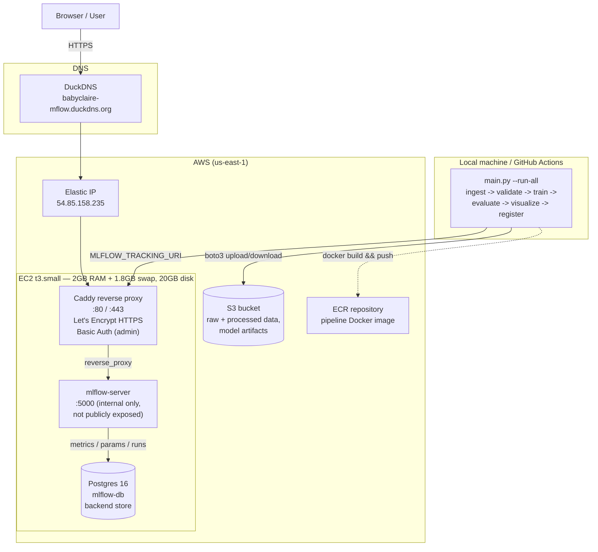

## System Architecture



**Public entry point:** only Caddy is internet-facing (ports 80/443). `mlflow-server` and
`mlflow-db` are reachable solely over the internal Docker network — neither is directly
exposed, so all traffic must pass through Caddy's HTTPS termination and Basic Auth first.

## Infrastructure Notes — Lessons Learned

Deploying the MLflow dashboard publicly (EC2 + Caddy + Let's Encrypt + Basic Auth)
surfaced two resource-sizing issues worth documenting, since the symptoms were
initially misleading:

### Memory exhaustion masqueraded as an SSH/networking failure

The instance was originally sized as `t3.micro` (1GB RAM). Running Postgres,
`mlflow-server`, and Caddy simultaneously left the OS with very little headroom —
under load, available memory dropped enough that **`sshd` itself became too starved
to complete new SSH handshakes**, even though:
- the instance showed **"Running"** with **passing EC2 status checks**,
- the **TCP connection to port 22 succeeded** (confirmed via `Test-NetConnection`),
- and the security group rules were correctly configured.

This combination made it look like a networking or security-group problem — status
checks passing usually implies "the instance is fine" — but the failure was actually
the SSH daemon being unable to respond under memory pressure. `dmesg` didn't show an
explicit OOM-killer event either, which is consistent with the system being *near*
the edge under load rather than an process actually getting killed at the moment it
was checked — the more direct evidence was memory usage sitting at 87%+ on `t3.micro`
during normal dashboard use, versus a comfortable 45% after resizing.

**Fix:** resized to `t3.small` (2GB RAM) and added a 1.8GB swap file as a safety
margin:
```bash
sudo fallocate -l 2G /swapfile
sudo chmod 600 /swapfile
sudo mkswap /swapfile
sudo swapon /swapfile
echo '/swapfile none swap sw 0 0' | sudo tee -a /etc/fstab
```

### Disk exhaustion, separately

The default 6.71GB root volume filled up from the combination of the OS, the
Docker engine, three rebuilt images (~1.8GB in `/var/lib/docker` +
`/var/lib/containerd`), and the swap file itself — reaching 99.7% used. Since the
disk was already provisioned as a GPT partition, growing the EBS volume in the AWS
console (8GB → 20GB) was reflected immediately at the block-device level, but the
filesystem needed to be told to claim the new space:
```bash
sudo growpart /dev/nvme0n1 1   # confirmed already grown to full disk in this case
sudo resize2fs /dev/nvme0n1p1  # this was the step that actually freed up space
df -h /
```

**Takeaway:** on a memory- or disk-constrained instance, passing status checks and a
successful TCP handshake are *necessary but not sufficient* signals that a service is
healthy — application-level responsiveness (SSH's own handshake, in this case) can
degrade well before infrastructure-level health checks notice anything wrong.

## Security

### Postgres credentials

`mlflow-db`'s password is **not** hardcoded in `docker-compose.yml` — it's read from a
`.env` file (gitignored, never committed) via `${POSTGRES_PASSWORD}`:

```yaml
mlflow-db:
  environment:
    POSTGRES_PASSWORD: ${POSTGRES_PASSWORD}
```

To rotate it on the server:

```bash
# 1. Generate a new password without ever printing it to the terminal
NEW_DB_PW=$(openssl rand -base64 18)
echo "$NEW_DB_PW" > ~/db_password_SAVE_THIS.txt && chmod 600 ~/db_password_SAVE_THIS.txt

# 2. Write it to .env (picked up by docker-compose automatically)
echo "POSTGRES_PASSWORD=$NEW_DB_PW" > .env && chmod 600 .env
unset NEW_DB_PW

# 3. Update the already-initialized Postgres user to match (the env var alone
#    only affects a *fresh* database initialization, not an existing one)
docker compose exec mlflow-db psql -U mlflow -d mlflow \
  -c "ALTER USER mlflow WITH PASSWORD '$(cat ~/db_password_SAVE_THIS.txt)';"

# 4. Recreate the dependent containers so they pick up the new .env
docker compose up -d --force-recreate mlflow-server mlflow-db

# 5. Clean up the plaintext file once saved to a password manager
rm ~/db_password_SAVE_THIS.txt
```

`mlflow-db` and `mlflow-server` are never exposed outside the Docker network (only Caddy
publishes ports 80/443 publicly), so this rotation is precautionary rather than a
response to any actual exposure.